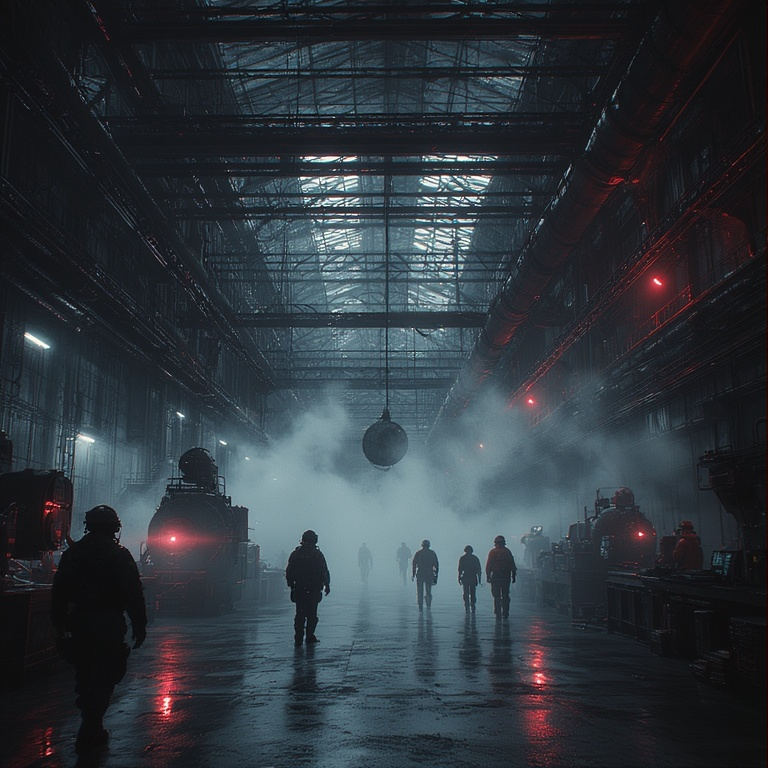
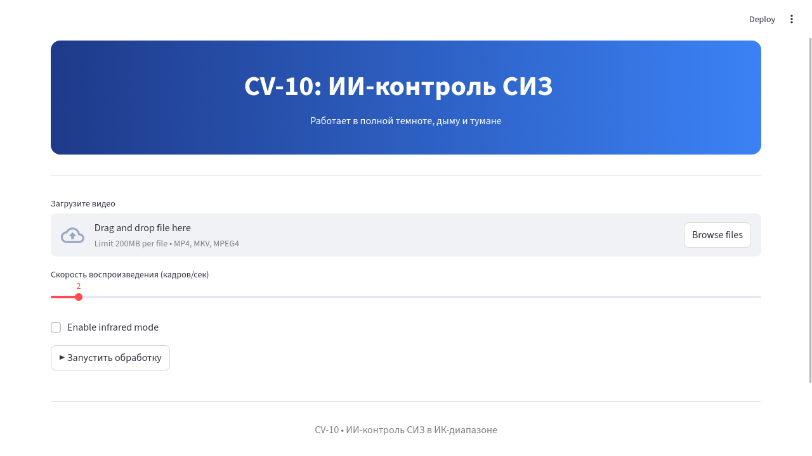
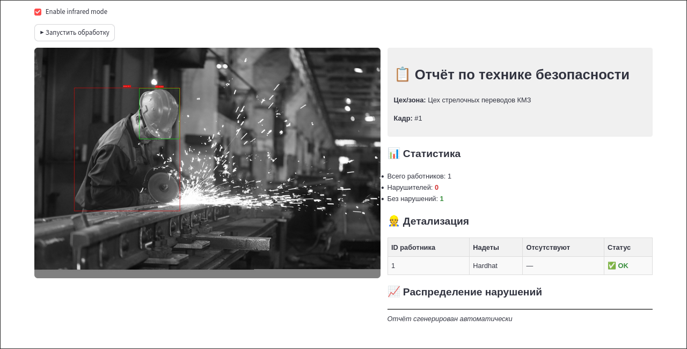

# infraPPE-monitor

**infraPPE-monitor** - это интеллектуальный модуль промышленной безопасности, анализирующий **инфракрасные (ИК) изображения** для контроля соблюдения правил использования средств индивидуальной защиты (СИЗ) в условиях __низкой видимости__ — при дыме, тумане, пыли или полном отсутствии света.

## 🎯 Цель проекта и реализация
Проект нацелен на разработку программного ядра для систем автоматизированного контроля безопасности на основе компьютерного зрения. Акцент сделан на работе в сложных условиях (отсутствие освещения, задымлённость) за счёт обработки данных инфракрасного диапазона.

### ✅ Достигнуто в текущей версии (ядро прототипа)
* **Конвейер обработки ИК-данных**: Реализован полный цикл — от загрузки/симуляции ИК-кадра до визуализации результатов.
* **Детекция и анализ**: Интеграция YOLOv8 для обнаружения людей и классификации основных элементов СИЗ (каска, жилет). Результаты привязываются к конкретному человеку.
* **Веб-интерфейс и отчётность**: Рабочий интерфейс на Streamlit для управления анализом. Автоматическая генерация отчётов с оценкой соответствия экипировки заданным требованиям.
* **Архитектурная готовность**: Кодовая база модульна, содержит инструменты для симуляции ИК-изображений, конвертации данных, детекции и отрисовки, что позволяет наращивать функционал.

### 🚀 Перспективы развития (за рамками текущей реализации)
* **Работа с реальным видеопотоком** в 25 FPS и интеграция с промышленными ИК-камерами.
* **Расширенная классификация СИЗ**: Поддержка большего числа классов (очки, перчатки, респираторы) и проверка корректности их ношения.
* **Глубокий анализ рисков**: Внедрение механизмов оценки уровня опасности и формирования пояснительных заключений о нарушениях.
* **Промышленная интеграция**: Разработка API и адаптеров для подключения к внешним системам (MES, ERP, СКУД).
* **Адаптивное обучение**: Возможность дообучения моделей на новых данных без полного перезапуска системы.

Данный прототип служит доказательством концепции и основой для дальнейшего развития в полноценную систему мониторинга.

## ⚙️ Технологии
- __Ядро__: Python, OpenCV, NumPy,
- __ML__: детекция и классификация СИЗ через YOLOv8,
- __Интерфейс__: Streamlit для веб-интерфейса и визуализации результатов
- __ИК-симуляция__: преобразование используя OpenCV,

## 📋 Атрибуция сторонних медиа-ресурсов

В проекте используются тестовые изображения из открытых источников, распространяемые под свободными лицензиями Creative Commons. Эти изображения применяются исключительно для тестирования и демонстрации работы системы.  

Полный список атрибуций, авторов и условий лицензирования находится в файле [CREDITS.md](./CREDITS.md). Этот файл необходим для соблюдения лицензионных требований при распространении проекта.  

**Основные лицензии тестовых данных**:

-  **CC BY-SA 4.0 International** — Свободное использование с обязательным указанием авторства и распространением производных работ под той же лицензией

-  **CC BY-SA 3.0 Germany (DE)** — Аналогичная лицензия для территории Германии

Все тестовые изображения получены из [Wikimedia Commons](https://commons.wikimedia.org/) — репозитория свободно распространяемых медиафайлов.

## 🧾 License

This project is licensed under the **GNU General Public License v3.0 only (GPL-3.0-only)**.  
This license guarantees the freedom to use, study, modify, and distribute the software,  
but prohibits incorporating it into closed commercial products without disclosing the source code.

See the full text in [LICENSE](./LICENSE).

**SPDX Identifier:** `GPL-3.0-only`

##

## Docker
* Сборка: `sudo docker build -t infra4ppe-monitor:latest .`
* Запуск: `sudo docker run -p 8501:8501 infra4ppe-monitor:latest`

